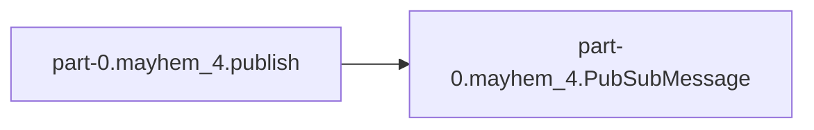
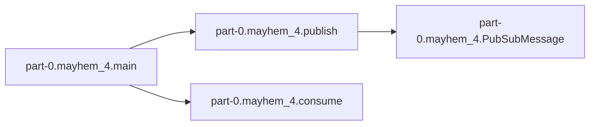

# Part-0 Mayhem 4

[_Documentation generated by Documatic_](https://www.documatic.com)

<!---Documatic-section-Codebase Structure-start--->
## Codebase Structure

<!---Documatic-block-system_architecture-start--->
```mermaid
None
```
<!---Documatic-block-system_architecture-end--->

# #
<!---Documatic-section-Codebase Structure-end--->

<!---Documatic-section-part_0.mayhem_4.publish-start--->
## part-0.mayhem_4.publish

<!---Documatic-section-publish-start--->


### Object Calls

* part-0.mayhem_4.PubSubMessage

<!---Documatic-block-part_0.mayhem_4.publish-start--->
<details>
	<summary><code>part_0.mayhem_4.publish</code> code snippet</summary>

```python
async def publish(queue, n):
    choices = string.ascii_lowercase + string.digits
    for x in range(1, n + 1):
        host_id = ''.join(random.choices(choices, k=4))
        instance_name = f'cattle-{host_id}'
        msg = PubSubMessage(message_id=x, instance_name=instance_name)
        await queue.put(msg)
        logging.info(f'Published {x} of {n} messages')
    await queue.put(None)
```
</details>
<!---Documatic-block-part_0.mayhem_4.publish-end--->
<!---Documatic-section-publish-end--->

# #
<!---Documatic-section-part_0.mayhem_4.publish-end--->

<!---Documatic-section-part_0.mayhem_4.consume-start--->
## part-0.mayhem_4.consume

<!---Documatic-section-consume-start--->
<!---Documatic-block-part_0.mayhem_4.consume-start--->
<details>
	<summary><code>part_0.mayhem_4.consume</code> code snippet</summary>

```python
async def consume(queue):
    while True:
        msg = await queue.get()
        if msg is None:
            break
        logging.info(f'Consumed {msg}')
        await asyncio.sleep(random.random())
```
</details>
<!---Documatic-block-part_0.mayhem_4.consume-end--->
<!---Documatic-section-consume-end--->

# #
<!---Documatic-section-part_0.mayhem_4.consume-end--->

<!---Documatic-section-part_0.mayhem_4.main-start--->
## part-0.mayhem_4.main

<!---Documatic-section-main-start--->


### Object Calls

* part-0.mayhem_4.publish
* part-0.mayhem_4.consume

<!---Documatic-block-part_0.mayhem_4.main-start--->
<details>
	<summary><code>part_0.mayhem_4.main</code> code snippet</summary>

```python
def main():
    queue = asyncio.Queue()
    loop = asyncio.get_event_loop()
    try:
        loop.create_task(publish(queue, 5))
        loop.create_task(consume(queue))
        loop.run_forever()
    except KeyboardInterrupt:
        logging.info('Process interrupted')
    finally:
        loop.close()
        logging.info('Successfully shutdown the Mayhem service.')
```
</details>
<!---Documatic-block-part_0.mayhem_4.main-end--->
<!---Documatic-section-main-end--->

# #
<!---Documatic-section-part_0.mayhem_4.main-end--->

[_Documentation generated by Documatic_](https://www.documatic.com)